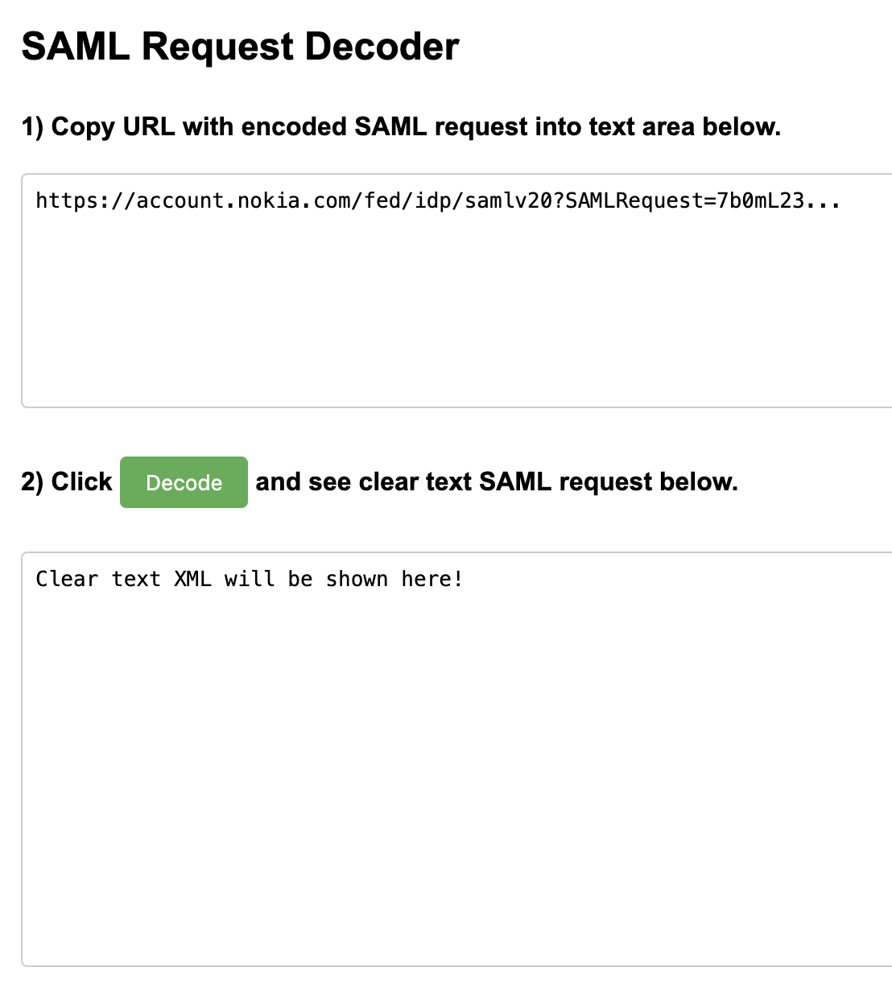

# SAMLdecode

A simple static tool to decode SAML HTTP-Redirect (deflated and Base64 encoded) requests.

## Screenshot

## Usage

1. Open `index.html` in your web browser.
2. Paste the full URL containing the `SAMLRequest=` parameter into the first textarea.
3. Click the **Decode** button.
4. The decoded and formatted SAML XML request appears in the second textarea.

## Files

- `index.html`: Main HTML page with embedded scripts and styles.
- `jquery-3.7.1.min.js`: jQuery dependency.
- `uneval.js`, `base64.js`, `rawinflate.js`, `rawdeflate.js`: JavaScript libraries for URL decoding, Base64 decoding, inflation/deflation.