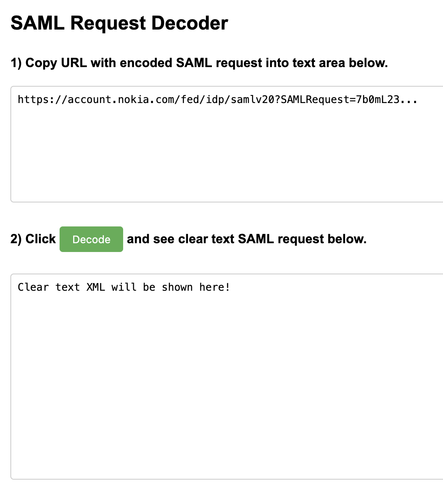

# SAMLdecode

A simple static tool to decode SAML HTTP-Redirect (deflated and Base64 encoded) requests.



## Usage

1. Open `index.html` in your web browser.
2. Paste the full URL containing the `SAMLRequest=` parameter into the first textarea.
3. Click the **Decode** button.
4. The decoded and formatted SAML XML request appears in the second textarea.

## Deployment

Hosted on S3 + CloudFront via GitHub Actions. All infrastructure is defined in CloudFormation.

### Parameters

Edit `cloudformation/bootstrap.yaml` before deploying:

| Parameter | Default | Description |
|-----------|---------|-------------|
| `MainStackName` | `saml-decode` | Stack name — also becomes the subdomain (`saml-decode.example.com`) |
| `GitHubRepo` | `kallu/SAMLdecode` | GitHub repo in `owner/repo` format |
| `GitHubBranch` | `master` | Branch allowed to deploy |
| `HostedZoneId` | `Z33QVR4S16MSXY` | Route 53 hosted zone ID |

Edit `cloudformation/saml-decode.yaml` for the domain:

| Parameter | Default | Description |
|-----------|---------|-------------|
| `HostedZoneId` | `Z33QVR4S16MSXY` | Route 53 hosted zone ID |
| `DomainSuffix` | `carriagereturn.nl` | Base domain |

### Bootstrap (one-time)

Run once manually to create the GitHub Actions OIDC provider and deploy role:

```bash
aws cloudformation deploy \
  --stack-name saml-decode-bootstrap \
  --template-file cloudformation/bootstrap.yaml \
  --capabilities CAPABILITY_NAMED_IAM \
  --region us-east-1
```

After that, every push to `master` automatically deploys infrastructure and uploads changed static assets.

### Adding/removing static assets

Edit `bom.txt` — the workflow will upload new files and delete removed ones from S3.

## Files

- `index.html`: Main HTML page with embedded scripts and styles.
- `jquery-3.7.1.min.js`: jQuery dependency.
- `uneval.js`, `base64.js`, `rawinflate.js`, `rawdeflate.js`, `formatxml.js`: JavaScript libraries for URL decoding, base64 decoding, inflation/deflation etc.
